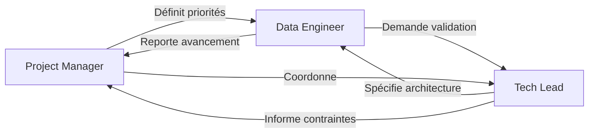

# Organisation de l'équipe - Rocket League Data Warehouse

## Vue d'ensemble

Ce dossier contient la définition des rôles et responsabilités de l'équipe projet pour le développement du Data Warehouse Rocket League.

---

## Les 3 rôles

### [Project Manager](./PROJECT_MANAGER.md)
**Focus**: Coordination, planning, livrables
- Pilote le projet et garantit les délais
- Coordonne les interactions entre les rôles
- Valide la qualité des livrables

### [Tech Lead](./TECH_LEAD.md)
**Focus**: Architecture, qualité technique, standards
- Conçoit l'architecture globale (3NF → Star Schema → Dashboard)
- Définit les standards et bonnes pratiques
- Valide les choix techniques et le code

### [Data Engineer](./DATA_ENGINEER.md)
**Focus**: Pipelines de données, qualité, implémentation
- Implémente les scripts d'ingestion et transformation
- Garantit la qualité et l'intégrité des données
- Optimise les performances des requêtes

---

## Matrice RACI - Atelier 1

| Tâche | PM | TL | DE |
|-------|----|----|-----|
| Définir le modèle 3NF | C | **R** | C |
| Créer le schéma ERD/MCD | I | **R** | C |
| Implémenter `ingestion.py` | I | C | **R** |
| Valider la qualité des données | C | C | **R** |
| Tester l'idempotence | I | C | **R** |
| Documenter le README | **R** | C | C |
| Valider les livrables | **R** | A | A |

**Légende** :
- **R** = Responsible (réalise la tâche)
- **A** = Accountable (décideur final)
- **C** = Consulted (consulté)
- **I** = Informed (informé)

---

## Workflow de collaboration



---

## Répartition par atelier

### Atelier 1 - Ingestion & Modélisation 3NF

| Rôle | Responsabilités clés |
|------|---------------------|
| **PM** | Planning, validation des livrables, mise à jour README |
| **TL** | Conception modèle 3NF, validation ERD, code review |
| **DE** | Implémentation ingestion.py, chargement données, tests qualité |

### Atelier 2 - Modélisation dimensionnelle

| Rôle | Responsabilités clés |
|------|---------------------|
| **PM** | Coordination migration 3NF → Star, validation livrables |
| **TL** | Conception modèle étoile, définition métriques, optimisation |
| **DE** | Implémentation transformations, création dims/facts, tests |

### Atelier 3 - Dashboard interactif

| Rôle | Responsabilités clés |
|------|---------------------|
| **PM** | Recueil besoins utilisateurs, validation UX, documentation |
| **TL** | Choix framework, architecture app, performance |
| **DE** | Préparation données, agrégations, connexion dashboard |

---

## Points de synchronisation

### Daily stand-up (5 min)
- Chaque rôle partage :
  - Ce qui a été fait hier
  - Ce qui sera fait aujourd'hui
  - Les blocages éventuels

### Revue d'atelier (30 min)
- Démo des fonctionnalités développées
- Validation collective des livrables
- Feedback et ajustements

### Rétrospective (15 min)
- Ce qui a bien fonctionné
- Ce qui peut être amélioré
- Actions pour l'atelier suivant

---

## Outils de collaboration

### Documentation
- **Markdown** : Fichiers .md pour la documentation
- **Mermaid** : Diagrammes intégrés dans le markdown
- **Comments** : Commentaires dans le code pour clarifier

### Code
- **Git** : Versionning et collaboration
- **GitHub** : Hébergement du repository
- **Code Review** : Via Pull Requests ou revue directe

### Communication
- **CLAUDE.md** : Instructions centralisées du projet
- **README.md** : Documentation utilisateur
- **docs/team/** : Documentation des rôles (ce dossier)

---

## Escalade des problèmes

```
Problème détecté
    ↓
DE tente de résoudre (30 min max)
    ↓ (si bloqué)
TL consulté pour solution technique
    ↓ (si hors périmètre technique)
PM décide arbitrage/priorisation
```

---

## Checklist de démarrage

Pour chaque membre de l'équipe :

- [ ] Lire le fichier de son rôle dans `docs/team/`
- [ ] Comprendre les interactions avec les autres rôles
- [ ] Lire `CLAUDE.md` pour le contexte projet
- [ ] Consulter le `README.md` principal
- [ ] Installer l'environnement (`pip install -r requirements.txt` ou `uv sync`)
- [ ] Vérifier l'accès aux données dans `data/raw/`

---

## Contact et support

- **Questions sur le projet** : Consulter le Project Manager
- **Questions techniques** : Consulter le Tech Lead
- **Questions sur les données** : Consulter le Data Engineer

---

*Dernière mise à jour : 2026-02-10*
