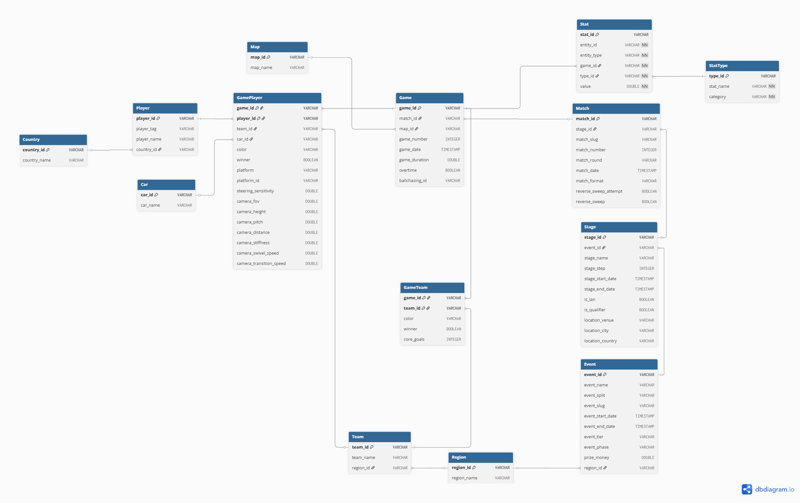

# Projet Datamart — Rocket League Esports

Projet d'analyse et d'entreposage de donnees pour des parties de **Rocket League** (RLCS 2021-22).
L'objectif est de structurer, charger et exploiter des statistiques in-game detaillees (mouvement, boost, positionnement, tirs, etc.).

Pipeline : `CSV (Kaggle) -> Modele relationnel 3NF (DuckDB) -> Schema en etoile -> Dashboard BI`

## Equipe

- **Samuel RESSIOT**
- **Rudolph ATTISSO**
- **Yassine ZOUITNI**

## Jeu de donnees

- **Source** : [RLCS 2021-22 — Kaggle](https://www.kaggle.com/datasets/dylanmonfret/rlcs-202122)
- **Origine** : donnees extraites d'[octane.gg](https://octane.gg)
- **Volume** : ~199 000 lignes au total

| Fichier | Lignes | Description |
|---------|--------|-------------|
| `main.csv` | ~18 700 | Donnees game-level : events, stages, matchs, maps, durations |
| `games_by_players.csv` | ~106 000 | Stats par joueur par game (shots, goals, saves, boost, movement, positioning, demos) |
| `games_by_teams.csv` | ~35 500 | Stats agregees par equipe par game |
| `matches_by_players.csv` | ~26 000 | Stats par joueur par match (agregees) |
| `matches_by_teams.csv` | ~10 500 | Stats par equipe par match (agregees) |
| `players_db.csv` | ~1 200 | Registre des joueurs (id, tag, nom, pays) |

Colonnes de jointure cles : `game_id`, `match_id`, `player_id`, `team_id`. Couleurs : `blue` / `orange`.

## Stack technique

Architecture serverless, sans backend, conforme aux contraintes de l'atelier.

| Composant | Technologie |
|-----------|-------------|
| Langage | Python 3.13 |
| Gestionnaire de paquets | [uv](https://docs.astral.sh/uv/) |
| ORM | SQLAlchemy 2.0 (DeclarativeBase, mapped_column) |
| Migrations | Alembic |
| Base de donnees | DuckDB (in-process, via duckdb-engine) |
| Data | pandas |
| Visualisation | matplotlib, seaborn |
| Presentation | Jupyter Notebook |

## Structure du projet

```
.
├── alembic/                    # Migrations Alembic
│   ├── env.py
│   └── versions/               # Fichiers de migration
├── data/
│   ├── raw/                    # CSVs bruts (gitignore)
│   └── rl.duckdb               # Base DuckDB (gitignore)
├── docs/
│   ├── ateliers/               # Consignes et resumes par atelier
│   └── database/schemas/       # ERD et schemas (mmd, dbml, png, svg)
├── notebooks/
│   └── 01_raw_extraction.ipynb # Extraction du dataset Kaggle
├── src/
│   ├── config.py               # Chemins et DATABASE_URL
│   └── database/
│       ├── engine.py           # SQLAlchemy engine + SessionLocal
│       └── models/             # 14 modeles ORM (5 modules)
├── alembic.ini
├── pyproject.toml
└── uv.lock
```

## Modele relationnel (3NF) — Atelier 1

Le schema normalise comprend **14 tables** reparties en 5 groupes :

| Groupe | Tables | Description |
|--------|--------|-------------|
| Referentiels | Country, Region, Map, Car | Lookups sans dependances |
| Entites | Player, Team | Acteurs principaux |
| Hierarchie | Event > Stage > Match > Game | Decomposition des competitions |
| Participation | GamePlayer, GameTeam | Liens game-level (couleur, winner, camera settings) |
| Stats (EAV) | StatType, Stat | Stats polymorphiques (entity_type = player/team) |

**Architecture polymorphique (EAV)** : la table `Stat` utilise `entity_id` + `entity_type` pour pointer vers Player ou Team. Ajouter une nouvelle statistique = `INSERT` dans `StatType`, pas de migration de schema.

### ERD



- [Source Mermaid](docs/database/schemas/schema_3nf.mmd)
- [DBML (dbdiagram.io)](docs/database/schemas/schema_3nf.dbml)
- [SVG](docs/database/schemas/schema_3nf.svg)

## Installation

### Prerequis

- Python 3.13+
- [uv](https://docs.astral.sh/uv/)
- Git

### Setup

```bash
# 1. Cloner le depot
git clone https://github.com/Sam-rst/EPSI_M1-Datamart
cd EPSI_M1-Datamart

# 2. Installer les dependances
uv sync

# 3. Extraire le dataset (notebook ou manuellement depuis Kaggle)
#    Les CSVs doivent etre dans data/raw/

# 4. Creer le schema et appliquer les migrations
uv run alembic upgrade head
```

### Utilisation

```bash
# Lancer un notebook
jupyter notebook

# Appliquer les migrations
uv run alembic upgrade head

# Voir l'historique des migrations
uv run alembic history

# Creer une nouvelle migration (manuelle, autogenerate non supporte avec DuckDB)
uv run alembic revision -m "description"
```

## Avancement par atelier

### Atelier 1 — Statistiques de parties

| Etape | Statut | Detail |
|-------|--------|--------|
| Jeu de donnees | Fait | RLCS 2021-22 via Kaggle (~199k lignes) |
| Stack technique | Fait | Python 3.13 + uv + DuckDB + Jupyter |
| Modele relationnel | Fait | 14 tables 3NF, ERD Mermaid + DBML |
| Chargement des donnees | En cours | Extraction OK, ETL Transform/Load a finir |

### Atelier 2 — Modele dimensionnel

| Etape | Statut | Detail |
|-------|--------|--------|
| Schema en etoile | A faire | fact_game_stats + dimensions |
| Alimentation des dimensions | A faire | Script Python/SQL |
| Remplissage des faits | A faire | Script Python/SQL |

### Atelier 3 — Visualisation

| Etape | Statut | Detail |
|-------|--------|--------|
| 5+ KPIs (2 simples + 2 croisees) | A faire | |
| 2 filtres interactifs | A faire | |
| Export CSV | A faire | |
